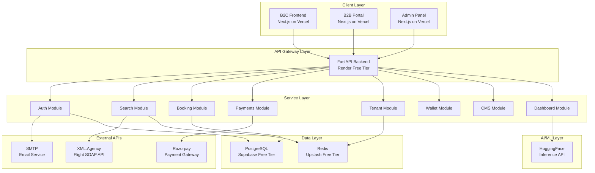
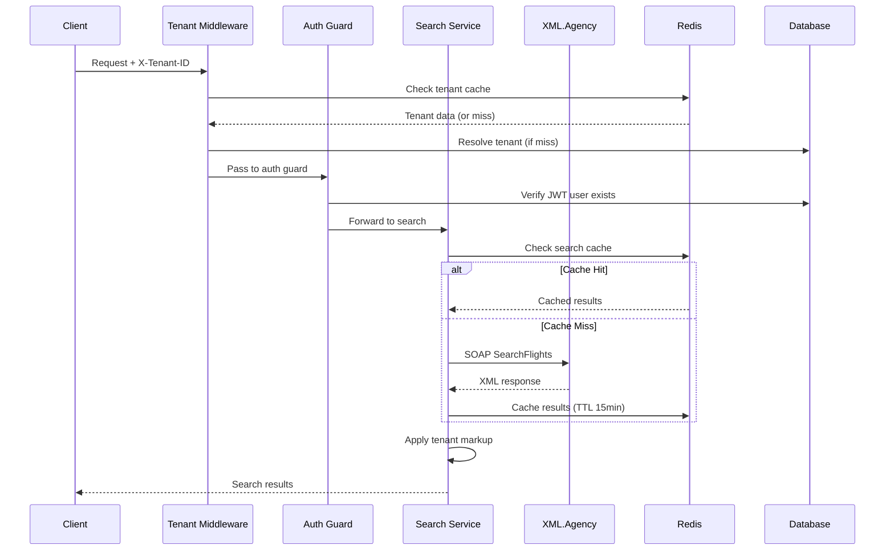
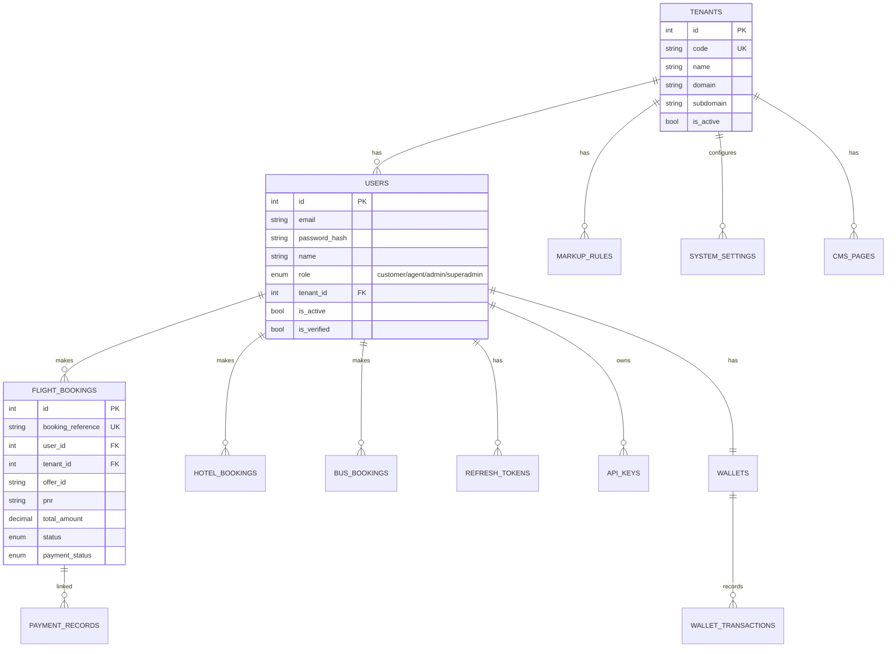
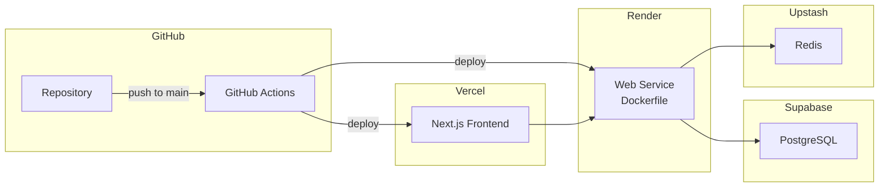

# Trurism B2B2C Travel Platform - System Architecture 
## 1. System Architecture

### 1a. High-Level Architecture



### 1b. Component Structure (Existing - Preserve)

```
app/
  core/          - Config, DB engine, Redis, Security, Mixins
  auth/          - JWT auth, RBAC, User model, Refresh tokens
  search/        - Flight/Hotel/Bus search, XML.Agency client
  booking/       - Flight/Hotel/Bus booking, Payment processor
  payments/      - Razorpay integration, Webhook handling
  wallet/        - Agent/User wallet, Credits, Transactions
  tenant/        - Multi-tenant middleware, Tenant CRUD
  markup/        - Price markup rules per tenant
  pricing/       - Pricing engine, Discounts, Convenience fees
  admin/         - Admin operations
  superadmin/    - Platform-level operations
  dashboard/     - B2C dashboard, Activity logs
  holidays/      - Holiday packages
  visa/          - Visa services
  activities/    - Tours and activities
  transfers/     - Airport transfers
  cms/           - Content management
  company/       - Company settings, Branding
  settings/      - System settings, Staff management
  files/         - File upload/download
  services/      - Email, PDF, Storage (cross-cutting)
  api_keys/      - API key management
migrations/      - Alembic migration chain (15 files)
scripts/         - seed.py, promote_superadmin.py
```

### 1c. Data Flow



### 1d. API Design (Existing - 80+ endpoints)

Already documented in [API_REFERENCE.md](file:///h:/Trurism/docs/API_REFERENCE.md). Key groups:

| Group | Prefix | Auth | Endpoints |
|-------|--------|------|-----------|
| Health | `/`, `/health` | None | 2 |
| Auth | `/auth` | Mixed | 8 |
| Search | `/search` | None | 6 |
| Bookings | `/bookings` | Bearer | 10+ |
| Payments | `/payments` | Bearer/Webhook | 8 |
| Wallet | `/wallet` | Bearer | 10+ |
| Admin | `/admin`, `/superadmin` | Admin/Superadmin | 15+ |
| Tenant | `/tenants` | Superadmin | 5 |
| CMS | `/cms` | Mixed | 10+ |
| Dashboard | `/dashboard` | Bearer | 8 |
| Markup/Pricing | `/markup`, `/pricing` | Admin | 10+ |
| Others | `/holidays`, `/visa`, `/activities`, `/transfers` | Mixed | 20+ |

### 1e. Database Schema



Full schema: 17 Alembic migrations, ~30 tables. `database_setup.sql` is stale (covers only 6 tables, missing tenants/wallet/payments/dashboard/pricing/CMS/holidays/visa/activities/transfers/company/settings/markup).

### 1f. Caching Strategy

| What | Key Pattern | TTL | Store |
|------|-------------|-----|-------|
| Search results | `search:{type}:{sha256}` | 15 min | Redis |
| Tenant resolution | `tenant:{id/code/host}` | 10 min | Redis |
| Token blacklist | `blacklist:{sha256}` | Token TTL | Redis (fallback: DB) |
| Wallet holds | `hold:{id}` | 30 min | Redis |
| OTP codes | `pwd_reset_otp:{email}` | 15 min | Redis |

Redis is optional. App degrades gracefully without it (no caching, DB-based blacklist).

### 1g. Hosting Strategy (Free Tier)

| Component | Service | Tier | Limits |
|-----------|---------|------|--------|
| Backend API | **Render** | Free | Spins down after 15min idle, 750h/month |
| Database | **Supabase** | Free | 500MB, 2 projects |
| Redis/Cache | **Upstash** | Free | 10k commands/day |
| Frontend | **Vercel** | Free | 100GB bandwidth |
| AI/ML | **HuggingFace** | Free inference | Rate limited |
| Email | **Gmail SMTP** | Free | 500/day |
| File Storage | **Supabase Storage** | Free | 1GB |
| CI/CD | **GitHub Actions** | Free | 2000 min/month |
| Monitoring | **UptimeRobot** + Render logs | Free | 50 monitors |

---

## 2. Scaling Analysis

| Users | DB | Cache | Backend | Concerns |
|-------|----|-------|---------|----------|
| 1 | Supabase free | None needed | Render free | Cold start 30s |
| 10 | Supabase free | Upstash free | Render free | Acceptable |
| 100 | Supabase free | Upstash free | Render free (may hit limits) | Search API rate limits |
| 1000 | Supabase Pro ($25/mo) | Upstash Pro ($10/mo) | Render Starter ($7/mo) | Need connection pooling, horizontal scaling |

---

## 3. Tradeoff Decisions

| Decision | Option A | Option B | Chosen | Why |
|----------|----------|----------|--------|-----|
| DB hosting | Local Docker Postgres | Supabase cloud | **Supabase** | Persistent, accessible from Render, free |
| Redis | Local Docker Redis | Upstash | **Upstash** (later). None for V0. | App works without Redis. Add when needed. |
| Migration source | `database_setup.sql` | Alembic migrations | **Alembic** | Single source of truth, versioned |
| Frontend deploy | Render static | Vercel | **Vercel** | Better Next.js support, edge CDN |
| AI integration | Self-hosted model | HuggingFace Inference API | **HF API** | Zero infra cost |
| Background jobs | Celery + Redis | In-process async | **In-process async** for now | No money for Redis worker. Celery later. |

---

## 4. Security Considerations

> [!IMPORTANT]
> These are non-negotiable before any public deployment.

- [x] JWT with refresh token rotation (implemented)
- [x] Token blacklisting with Redis + DB fallback (implemented)
- [x] Rate limiting via slowapi (implemented)
- [x] Security headers (CSP, HSTS, X-Frame-Options) (implemented)
- [x] Trusted host middleware (implemented)
- [x] Input validation via Pydantic v2 (implemented)
- [x] CORS restriction in production (implemented)


## 5. Deployment Architecture



### CI/CD Pipeline (GitHub Actions)

```yaml
# Proposed workflow
on push to main:
  1. Lint (ruff)
  2. Type check (mypy)
  3. Test (pytest --cov)
  4. Build Docker image
  5. Deploy to Render (auto-deploy on push)
  6. Run alembic upgrade head (in start.sh)
  7. Health check verification
```

### Docker Setup (Already exists - `Dockerfile` + `start.sh`)

Existing Dockerfile is functional. `start.sh` runs `alembic upgrade head` then `uvicorn`. Good pattern.

---
